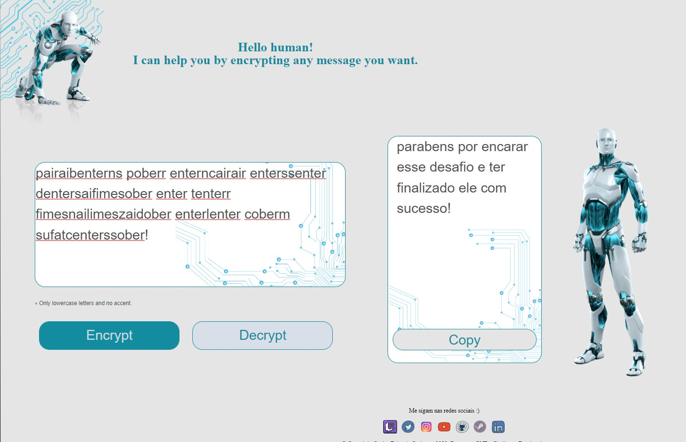

<h1 align="center"> Challenge ONE  Decodificador de texto </h1>

## :man_artist: Autor</h2>

[kaduej](https://github.com/kaduej) :wave:

- Recebemos um desafio para criarmos um decodificador de mensagens de texto.
- Utilizando os conhecimentos adquiridos nos cursos de formação iniciante em programação do programa ONE, foi possível criar a página e suas funcionalidades.
- Ainda precisa de melhorias, principalmente em responsividade, mas a medida que for adquirindo conhecimento, pretendo ir melhorando os projetos e challenges.

## :computer: Descrição
Nesse projeto utilizei:

:point_right: HTML

:point_right: CSS 

:point_right: Javascript

<h2 align="center">
  🚀 Prévia do layout do projeto
</h2>

  

- Você pode acessar a página através desse <a href='https://kaduej.github.io/Challenge-Alura-ONE/'>Link!</a>
